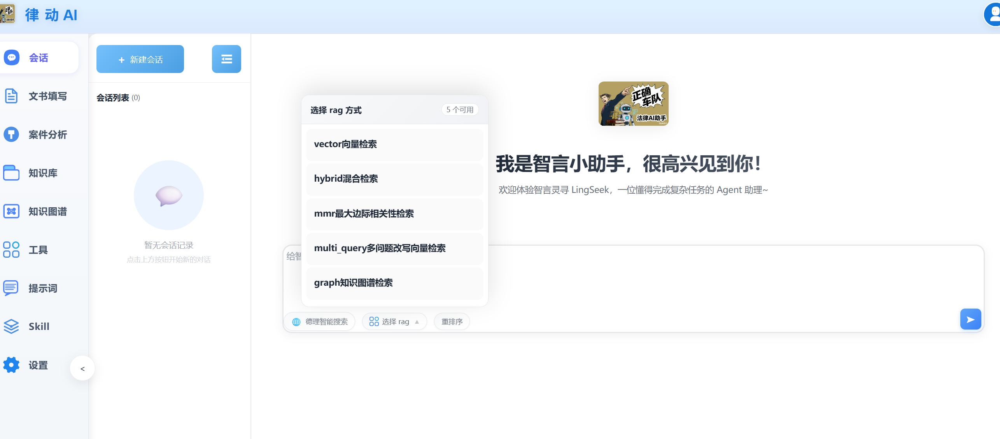

***

技术栈：

前端：Vue3\
后端：FastAPI + 混合检索RAG
agent智能体框架：Langchain\
项目依赖管理工具：uv

docker中部署：ollama 向量嵌入模型，neo4j 图数据库，chroma 向量数据库，redis 任务队列。

***

后端目前架构：

```bash
backend/
├── app/
│   ├── main.py              # 整个应用的入口，配置中间件和路由总装
│   ├── core/
│   │   ├── config.py        # 使用 Pydantic-settings 管理 .env 环境变量
│   │   └── constants.py    # 状态码和常量定义
│   ├── schema/
│   │   ├── chat.py          # 对话请求体和响应体的 Pydantic 模型
│   │   ├── config.py        # 配置管理相关的请求和响应模型
│   │   ├── prompt_config.py # 提示词配置查询的响应模型
│   │   ├── rag.py           # RAG相关的请求和响应模型
│   │   └── auth.py          # 用户认证相关的请求和响应模型
│   ├── api/
│   │   └── v1/
│   │       ├── chat.py      # 多轮对话接口路由（支持SSE流式输出）
│   │       ├── config.py    # 环境配置管理接口路由
│   │       ├── prompts.py   # 提示词配置查询接口路由
│   │       ├── rag.py       # RAG文档管理接口路由
│   │       ├── graph.py     # 知识图谱管理接口路由（上传/查询/统计）
│   │       ├── form_filling.py # 表单填写接口路由
│   │       ├── auth.py      # 用户认证接口路由（注册/登录）
│   │       └── cyber_judge.py # 赛博判官接口路由（支持最终回答SSE流式输出）
│   └── service/             # 业务逻辑服务层
│       ├── agent/           # LangGraph多轮对话Agent
│       │   ├── factory.py               # Agent工厂，管理LLM和RAG检索器实例
│       │   ├── legal_conversation_agent.py # LangGraph多轮对话Agent核心
│       │   ├── conversation_state.py    # 对话状态定义（TypedDict）
│       │   ├── conversation_manager.py  # 对话管理器（滑动窗口、历史压缩）
│       │   ├── rag_retriever.py         # RAG检索器（集成AdvancedRAGService）
│       │   ├── intent_classifier.py     # 意图识别模块（闲聊/追问/新问题）
│       │   ├── query_rewriter.py        # Query改写模块（指代消解/省略补全）
│       │   ├── entity_extractor.py      # 实体识别模块（NER模型+规则匹配）
│       │   ├── pre_retriever.py         # 预检索服务（并行优化）
│       │   ├── retrieval_pipeline.py    # 智能检索流程控制管道（并行执行）
│       │   ├── sse_streamer.py          # SSE流式输出处理器
│       │   ├── tools.py                 # 法律查询、赔偿计算等自定义工具
│       │   └── official_tools.py        # 官方工具（案例检索、法规检索）
│       ├── prompts/          # 提示词模板集中管理
│       │   └── conversation_prompts.py  # 多轮对话提示词模板
│       ├── cyber_judge/      # 赛博判官服务
│       │   ├── agent.py                 # 赛博判官Agent编排与最终回答流式输出
│       │   ├── prompts.py               # 赛博判官提示词模板（已接入 /api/v1/prompts 查询）
│       │   ├── fact_extractor.py        # 赛博判官事实提取与关键词生成
│       │   └── tools.py                 # 赛博判官案例/法规检索工具封装
│       ├── rag/             # RAG文档处理服务
│       │   ├── hybrid_retriever.py      # 混合检索器（Vector+BM25+MMR+MultiQuery）
│       │   ├── text_embedding.py        # RAG文档处理核心服务
│       │   ├── file_hasher.py           # 文件MD5去重
│       │   ├── file_processor.py        # 文件处理（PDF、Word、Excel等）
│       │   ├── ollama_embedding.py      # Ollama文本嵌入服务
│       │   └── reranker.py              # 检索结果重排序
│       ├── vector_db.py      # 向量数据库（Chroma）的初始化与检索封装
│       ├── graph/            # 知识图谱服务
│       │   ├── graph_db.py              # Neo4j图数据库封装
│       │   ├── graph_retriever.py       # 知识图谱检索器（实体/关系/相关实体搜索）
│       │   ├── graph_builder_v2.py      # 知识图谱构建器（LLMGraphTransformer）
│       │   ├── legal_graph_schema.py    # 法律图谱Schema定义（实体/关系类型）
│       │   └── graph_prompts.py         # 知识图谱提示词配置
│       ├── form_filling/    # 法律文书智能填充服务
│       │   ├── slot_manager.py         # 槽位状态管理器（Redis持久化）
│       │   ├── slot_extractor.py       # 语义提取引擎
│       │   ├── doc_renderer.py        # 文档渲染服务
│       │   ├── conversation_strategy.py # 对话策略管理
│       │   └── prompts/               # 提示词模板集中管理
│       │       ├── block_descriptions.py    # 各业务块槽位描述
│       │       ├── extraction_prompt.py     # 槽位提取提示词模板
│       │       └── conversation_prompts.py  # 对话引导语/槽位问题
│       └── tasks/            # 异步任务处理
│           ├── document_tasks.py        # 文档处理异步任务
│           └── graph_tasks.py           # 知识图谱构建异步任务（Celery）
│       ├── auth_service.py   # 用户认证服务（文件化存储用户数据）
├── scripts/
│   ├── init-model.sh         # 模型初始化脚本
│   └── init-model-optimized.sh  # 优化的模型初始化脚本
├── .env                      # 存放 API_KEY 和数据库连接串
├── pyproject.toml            # 项目依赖配置
├── backend/ollama_models/    # Ollama 模型存储目录（Docker 挂载点）
├── backend/neo4j/            # Neo4j 图数据库目录（Docker 挂载点）
│   ├── data/                 # 数据库数据
│   ├── logs/                 # 日志文件
│   └── import/               # 数据导入文件
├── backend/chroma_data/      # Chroma 向量数据库数据目录（Docker 挂载点）
├── backend/uploads/          # 上传文件存储目录
├── backend/logs/              # 应用日志目录
│   ├── app.log               # 应用主日志
│   ├── error.log             # 错误日志
│   ├── celery.log            # Celery任务日志
│   └── celery_error.log      # Celery错误日志
├── data/                     # 存放法律文档模板文件和用户数据
│   ├── users.json            # 用户数据文件（注册/登录）
├── docs/                     # 存放 API 文档（如 Swagger/OpenAPI）
└── tests/                    # 存放单元测试代码
```

***

命令：
激活环境：

```bash
cd backend
.venv\Scripts\activate
```

启动docker容器：

```bash
docker-compose up -d
```

向量模型下载启动脚本：

```bash
docker exec legal-embedding-server bash /scripts/init-model.sh
```

启动后端服务：

```bash
cd backend
uv run uvicorn app.main:app --host 0.0.0.0 --port 8000 --reload
```

启动Celery Worker（用于异步任务处理）：

````bash
cd backend
# Windows
scripts\start-celery.bat

# Linux/Mac
bash scripts/start-celery.sh
```s

下载所需huggingface模型：
Cross-Encoder模型 (重排序):   cross-encoder/ms-marco-MiniLM-L-6-v2  
NER模型 (实体识别):    uer/roberta-base-finetuned-cluener2020-chinese
```bash
cd backend
uv run python scripts/download_models.py
````

清空日志内容:

```bash
uv run clear_logs.py
```

杀掉8000端口进程:

```bash
uv run python scripts/kill_port.py 8000
```

拉取前端代码:

```bash
git fetch origin
git -C F:\Law-agent checkout origin/frontend -- frontend/
```

API文档：
启动服务后访问：<http://localhost:8000/docs>
git -C F:\Law-agent checkout origin/frontend -- frontend/

***

Agent回答流程详解（并行优化版）：

```
┌─────────────────────────────────────────────────────────────────────────────────┐
│                           用户请求入口                                            │
│                    POST /api/v1/chat/message                                     │
│            (retrieval_strategy 由用户参数决定: vector/hybrid/mmr/multi_query/graph) │
└─────────────────────────────────────────────────────────────────────────────────┘
                                        │
                                        ▼
┌─────────────────────────────────────────────────────────────────────────────────┐
│                           Step 1: 会话管理                                        │
│                                                                                 │
│   • 检查session_id是否存在，不存在则自动生成                                       │
│   • 新会话时自动生成会话标题（基于用户首条消息）                                     │
│   • 从checkpointer加载历史对话状态                                                │
│   • 构建ConversationState对象                                                    │
└─────────────────────────────────────────────────────────────────────────────────┘
                                        │
                                        ▼
┌─────────────────────────────────────────────────────────────────────────────────┐
│                    Step 2: 并行执行（性能优化核心）                                 │
│                                                                                 │
│   模块: SmartRetrievalPipeline._process_parallel                                │
│   技术: asyncio.gather 并行执行多个独立任务                                        │
│                                                                                 │
│   ┌─────────────────────────────────────────────────────────────────────────┐   │
│   │                     并行任务组                                            │   │
│   │                                                                         │   │
│   │   ┌───────────────┐   ┌───────────────┐   ┌───────────────┐            │   │
│   │   │ IntentClassifier│   │EntityExtractor│   │ PreRetriever  │            │   │
│   │   │   意图识别     │   │   实体识别    │   │   预检索      │            │   │
│   │   │               │   │               │   │               │            │   │
│   │   │ • 模式匹配    │   │ • NER模型    │   │ • 向量检索    │            │   │
│   │   │ • LLM分类     │   │ • 规则匹配   │   │ • 快速召回    │            │   │
│   │   │               │   │               │   │               │            │   │
│   │   │ 输出:         │   │ 输出:         │   │ 输出:         │            │   │
│   │   │ IntentResult  │   │ EntityResult  │   │PreRetrieveResult│           │   │
│   │   └───────────────┘   └───────────────┘   └───────────────┘            │   │
│   │         │                   │                   │                      │   │
│   │         └───────────────────┴───────────────────┘                      │   │
│   │                             │                                          │   │
│   │                             ▼                                          │   │
│   │                    asyncio.gather(*tasks)                              │   │
│   │                    同时执行，等待全部完成                                │   │
│   └─────────────────────────────────────────────────────────────────────────┘   │
│                                                                                 │
│   性能提升: 原串行时间 T1+T2+T3 → 并行时间 max(T1,T2,T3)                         │
│   典型优化: 约60%时间减少                                                        │
└─────────────────────────────────────────────────────────────────────────────────┘
                                        │
                                        ▼
┌─────────────────────────────────────────────────────────────────────────────────┐
│                           Step 3: 结果合并与分流                                   │
│                                                                                 │
│   根据并行执行结果决定后续流程:                                                    │
│                                                                                 │
│   ┌──────────────────────────────────────────────────────────────────────┐     │
│   │   意图分流:                                                           │     │
│   │                                                                      │     │
│   │   chitchat (闲聊) ──────────────────────────────────► 跳过检索       │     │
│   │                                                      直接对话        │     │
│   │                                                                      │     │
│   │   new_question (新问题) ──► 预检索质量评估 ──► 记录提示信息           │     │
│   │                              │                  │                    │     │
│   │                              │                  ▼                    │     │
│   │                              │         pre_retrieval_hint:           │     │
│   │                              │         • no_results: 无结果          │     │
│   │                              │         • high_quality: 质量高        │     │
│   │                              │         • low_quality: 质量一般       │     │
│   │                              │                                       │     │
│   │                              └──────────────► 继续执行RAG检索        │     │
│   │                                                                      │     │
│   │   follow_up (追问) ──► Query改写 ──► 执行RAG检索                     │     │
│   │                                                                      │     │
│   │   ⚠️ 重要: 预检索只做前置检查，不替代RAG检索                          │     │
│   │            模型回答的知识库内容必须来自RAG检索                         │     │
│   └──────────────────────────────────────────────────────────────────────┘     │
│                                                                                 │
│   实体增强:                                                                      │
│   • 提取法律实体（法条名称、案例类型、金额等）                                      │
│   • 用于Query增强和检索过滤                                                       │
└─────────────────────────────────────────────────────────────────────────────────┘
                                        │
                                        ▼
┌─────────────────────────────────────────────────────────────────────────────────┐
│                           Step 4: Query改写（按需）                                │
│                                                                                 │
│   模块: QueryRewriter                                                           │
│   触发条件: intent == "follow_up"                                                │
│                                                                                 │
│   改写类型:                                                                      │
│   • 指代消解: "它是什么？" → "劳动合同法第39条是什么？"                             │
│   • 省略补全: "有什么后果？" → "违反劳动合同法第39条有什么后果？"                   │
│   • 追问重述: "再回答一下" → 提取上一轮的完整问题                                  │
│   • 实体增强: 结合EntityExtractor识别的实体优化查询                               │
│                                                                                 │
│   输出: RewrittenQuery (original_query, rewritten_query, rewrite_type)          │
└─────────────────────────────────────────────────────────────────────────────────┘
                                        │
                                        ▼
┌─────────────────────────────────────────────────────────────────────────────────┐
│                           Step 5: RAG检索（始终执行）                              │
│                                                                                 │
│   模块: RAGRetriever → AdvancedRAGService                                       │
│   条件: use_rag == true 且 intent != "chitchat"                                 │
│                                                                                 │
│   ⚠️ 重要: RAG检索始终执行，预检索结果不作为回答参考                               │
│                                                                                 │
│   检索策略（用户参数控制）:                                                        │
│   • vector: 向量检索 - 基于语义相似度                                             │
│   • hybrid: 混合检索 - 向量 + BM25关键词，RRF融合                                 │
│   • mmr: MMR检索 - 平衡相关性和多样性                                            │
│   • multi_query: 多查询检索 - 生成查询变体提高召回率                               │
│   • graph: 知识图谱检索 - 结构化知识查询（实体/关系/相关实体搜索）                  │
│                                                                                 │
│   可选重排序: enable_rerank == true 时使用Cross-Encoder精排                       │
│                                                                                 │
│   输出: List[Document] (检索到的相关文档，作为模型回答的知识库参考)                │
│                                                                                 │
│   知识图谱检索详情:                                                               │
│   • 实体搜索: 根据查询词搜索匹配的实体节点                                         │
│   • 关系搜索: 搜索实体之间的关系路径                                              │
│   • 相关实体搜索: 搜索与查询实体相关的其他实体                                     │
│   • 返回格式: 转换为标准Document格式，包含实体/关系/相关实体信息                   │
└─────────────────────────────────────────────────────────────────────────────────┘
                                        │
                                        ▼
┌─────────────────────────────────────────────────────────────────────────────────┐
│                           Step 6: 工具调用（可选）                                 │
│                                                                                 │
│   模块: OfficialTools                                                           │
│   条件: enable_tools == true                                                     │
│                                                                                 │
│   可用工具:                                                                      │
│   • search_cases: 案例检索 - 搜索相关法律案例                                     │
│   • search_laws: 法规检索 - 搜索相关法律法规                                      │
│                                                                                 │
│   流程: LLM判断是否需要工具 → 执行工具调用 → 返回结果                              │
└─────────────────────────────────────────────────────────────────────────────────┘
                                        │
                                        ▼
┌─────────────────────────────────────────────────────────────────────────────────┐
│                           Step 7: LLM生成回答                                     │
│                                                                                 │
│   模块: LegalConversationAgent._generate_node                                   │
│                                                                                 │
│   根据不同场景选择Prompt:                                                         │
│   • 有RAG检索结果: RAG_SYSTEM_PROMPT + context + query                          │
│   • 有工具调用结果: 基于工具返回结果回答                                           │
│   • 无检索结果: SYSTEM_PROMPT (通用法律助手)                                      │
│   • RAG启用但无结果: 提示用户知识库无相关文档                                      │
│                                                                                 │
│   输出: AIMessage (最终回答)                                                     │
└─────────────────────────────────────────────────────────────────────────────────┘
                                        │
                                        ▼
┌─────────────────────────────────────────────────────────────────────────────────┐
│                           Step 8: 响应返回                                        │
│                                                                                 │
│   非流式响应:                                                                    │
│   {                                                                             │
│     "code": 200,                                                                │
│     "data": {                                                                   │
│       "content": "回答内容",                                                     │
│       "sources": [...],           // RAG引用来源                                 │
│       "intent": "follow_up",      // 识别的意图                                  │
│       "rewritten_query": "...",   // 改写后的查询                                │
│       "original_query": "...",    // 原始查询                                    │
│       "entities": {...},          // 识别的实体                                  │
│       "pre_retrieval_used": true, // 是否使用预检索                               │
│       "parallel_execution": true, // 是否并行执行                                 │
│       "total_time": 0.85,         // 总处理时间(秒)                              │
│       "tools_used": [...]         // 使用的工具                                  │
│     }                                                                           │
│   }                                                                             │
│                                                                                 │
│   流式响应 (SSE):                                                                │
│   event: token      → 实时输出token                                              │
│   event: tool_start → 工具调用开始                                               │
│   event: tool_end   → 工具调用结束                                               │
│   event: intent     → 意图识别结果                                               │
│   event: entities   → 实体识别结果                                               │
│   event: sources    → RAG引用来源                                                │
│   event: done       → 响应完成                                                   │
└─────────────────────────────────────────────────────────────────────────────────┘
```

***

并行优化详解：

┌─────────────────────────────────────────────────────────────────────────────────┐
│                           并行执行架构                                            │
│                                                                                 │
│   原串行流程:                                                                    │
│   ┌─────────┐    ┌─────────┐    ┌─────────┐    ┌─────────┐                     │
│   │ 意图识别 │───►│ 实体识别 │───►│ 预检索  │───►│ Query改写│                    │
│   │  \~200ms │    │  \~150ms │    │  \~300ms │    │  \~200ms │                     │
│   └─────────┘    └─────────┘    └─────────┘    └─────────┘                     │
│   总耗时: \~850ms                                                                │
│                                                                                 │
│   并行优化后:                                                                    │
│   ┌─────────────────────────────────────────────────────────────────────────┐   │
│   │                                                                         │   │
│   │   ┌─────────┐                                                          │   │
│   │   │ 意图识别 │ ─┐                                                       │   │
│   │   │  \~200ms │  │                                                       │   │
│   │   └─────────┘  │                                                       │   │
│   │                 │    ┌─────────┐    ┌─────────┐                        │   │
│   │   ┌─────────┐   ├───►│ 结果合并 │───►│ Query改写│                       │   │
│   │   │ 实体识别 │ ─┤    │         │    │  \~200ms │                        │   │
│   │   │  \~150ms │  │    └─────────┘    └─────────┘                        │   │
│   │   └─────────┘  │                                                       │   │
│   │                 │                                                       │   │
│   │   ┌─────────┐   │                                                       │   │
│   │   │ 预检索  │ ─┘                                                       │   │
│   │   │  \~300ms │                                                          │   │
│   │   └─────────┘                                                          │   │
│   │                                                                         │   │
│   └─────────────────────────────────────────────────────────────────────────┘   │
│   总耗时: max(200,150,300) + 200 = \~500ms                                       │
│   性能提升: 约40%                                                               │
│                                                                                 │
└─────────────────────────────────────────────────────────────────────────────────┘

实体识别模块：
┌─────────────────────────────────────────────────────────────────────────────────┐
│                           EntityExtractor                                        │
│                                                                                 │
│   NER模型: uer/roberta-base-finetuned-cluener2020-chinese                       │
│   轻量级中文实体识别模型，支持以下实体类型:                                         │
│   • address (地址)                                                              │
│   • organization (组织机构)                                                      │
│   • name (人名)                                                                 │
│   • position (职位)                                                             │
│   • government (政府机构)                                                        │
│                                                                                 │
│   法律领域规则匹配（补充）:                                                        │
│   • law\_name: 法条名称（如"劳动合同法"、"民法典"）                                 │
│   • article: 条款号（如"第39条"、"第107条"）                                      │
│   • topic: 法律主题（如"经济补偿金"、"工伤认定"）                                  │
│   • case\_type: 案件类型（如"劳动争议"、"合同纠纷"）                                │
│   • amount: 金额（如"10万元"、"3个月工资"）                                       │
│   • time\_period: 时间期限（如"诉讼时效"、"仲裁时效"）                              │
│   • action: 行为（如"计算"、"赔偿"、"解除"）                                      │
│                                                                                 │
│   输出应用:                                                                      │
│   • Query增强: 将识别的实体加入查询                                               │
│   • 检索过滤: 基于实体构建元数据过滤条件                                           │
│   • 响应展示: 在API响应中返回识别的实体信息                                        │
│                                                                                 │
└─────────────────────────────────────────────────────────────────────────────────┘

预检索服务：
┌─────────────────────────────────────────────────────────────────────────────────┐
│                           PreRetriever                                           │
│                                                                                 │
│   功能: 在意图识别和实体识别的同时，使用原始Query进行快速向量检索                    │
│                                                                                 │
│   工作原理:                                                                      │
│   1. 接收原始Query，立即发起向量检索                                              │
│   2. 与意图识别、实体识别并行执行                                                  │
│   3. 如果意图是"新问题"且预检索有结果，直接使用预检索结果                          │
│   4. 如果意图是"追问"，则丢弃预检索结果，使用改写后的Query重新检索                  │
│                                                                                 │
│   优势:                                                                         │
│   • 减少新问题的响应延迟（无需等待意图识别后再检索）                                │
│   • 充分利用并行时间，提高资源利用率                                               │
│   • 对于简单问题，可直接返回预检索结果                                             │
│                                                                                 │
└─────────────────────────────────────────────────────────────────────────────────┘

***

多轮对话API说明：

基于LangGraph实现的多轮对话系统，支持流式输出和可选的RAG检索。

核心特性：

- 多轮对话管理：基于session\_id维护对话上下文
- 滑动窗口：自动控制历史记录长度（默认10轮，可配置1-50）
- 流式输出：支持SSE实时输出，提升用户体验
- RAG集成：可选启用RAG检索，支持多种检索策略
- 智能意图识别：自动识别闲聊/追问/新问题，优化检索效果
- Query改写：指代消解、省略补全、追问重述
- 会话管理：完整的会话生命周期管理（创建、查询、删除、清空）
- 会话标题：自动生成会话标题，便于识别和管理会话

检索策略：

- vector：向量检索（基于语义相似度）
- hybrid：混合检索（向量+BM25关键词）
- mmr：最大边际相关性检索（平衡相关性和多样性）
- multi\_query：多查询检索（生成多个查询变体）

意图类型：

- chitchat：闲聊（问候、感谢等），跳过检索直接对话
- follow\_up：追问（指代、省略、追问），需要Query改写后检索
- new\_question：新问题，直接检索或简单优化后检索

API接口：

- POST /api/v1/chat/message - 发送消息（支持流式和RAG）
- GET /api/v1/chat/sessions/{session\_id} - 获取会话信息
- GET /api/v1/chat/sessions/{session\_id}/history - 获取对话历史
- DELETE /api/v1/chat/sessions/{session\_id} - 删除会话
- GET /api/v1/chat/sessions - 获取会话列表
- POST /api/v1/chat/sessions/{session\_id}/clear - 清空会话历史

请求示例：

```json
{
  "message": "劳动纠纷中如何计算经济补偿金？",
  "session_id": "session-123",
  "user_id": "user-456",
  "use_rag": true,
  "retrieval_strategy": "hybrid",
  "max_history": 10,
  "stream": false
}
```

响应示例：

```json
{
  "code": 200,
  "status": "success",
  "data": {
    "message_id": "xxx",
    "session_id": "session-123",
    "content": "根据《劳动合同法》第四十七条规定...",
    "title": "劳动纠纷经济补偿金计算",
    "sources": [
      {
        "content": "劳动合同法第四十七条...",
        "metadata": {"file_name": "劳动法.pdf", "chunk_index": 0}
      }
    ],
    "rag_used": true,
    "retrieval_strategy": "hybrid",
    "intent": "new_question",
    "original_query": "劳动纠纷中如何计算经济补偿金？",
    "rewritten_query": "劳动纠纷中如何计算经济补偿金？"
  }
}
```

***

法律文书智能填充模块：

```
┌─────────────────────────────────────────────────────────────────────────────────┐
│                        法律文书智能填充系统架构                                 │
└─────────────────────────────────────────────────────────────────────────────────┘

┌──────────────────┐    ┌──────────────────┐    ┌──────────────────┐
│   前端对话界面    │───►│  FastAPI 接口层   │───►│  文书填充Agent    │
└──────────────────┘    └──────────────────┘    └──────────────────┘
                                                        │
                        ┌───────────────────────────────┼───────────────────────────────┐
                        ▼                               ▼                               ▼
              ┌──────────────────┐            ┌──────────────────┐            ┌──────────────────┐
              │   槽位状态管理    │            │   语义提取引擎    │            │   文档渲染服务    │
              │  (SlotManager)   │            │ (SlotExtractor)  │            │ (DocRenderer)    │
              └──────────────────┘            └──────────────────┘            └──────────────────┘
                        │                               │
                        ▼                               ▼
              ┌──────────────────┐            ┌──────────────────┐
              │  业务块状态机     │            │   LLM + Prompt   │
              │ (BlockFSM)       │            │   (槽位填充指令)  │
              └──────────────────┘            └──────────────────┘
```

核心功能模块：

1. **槽位状态管理 (SlotManager)**
   - 管理填写会话状态
   - 跟踪每个槽位的值、确认状态、置信度
   - 计算业务块和整体完成率
   - 支持槽位更新、查询、删除
2. **语义提取引擎 (SlotExtractor)**
   - 从用户自然语言中提取结构化信息
   - 支持多业务块的信息提取
   - 智能推断隐含信息
   - 生成澄清问题
3. **文档渲染服务 (DocRenderer)**
   - 加载Word模板文件
   - 使用占位符填充数据
   - 生成最终文档
   - 支持文档下载
4. **对话策略管理 (ConversationStrategy)**
   - 根据当前状态生成引导问题
   - 处理用户意图（修改、跳转、完成）
   - 决定下一步行动

业务块划分：

| 业务块              | 说明    | 必填项                 |
| ---------------- | ----- | ------------------- |
| plaintiff        | 原告信息  | 姓名、电话、住址            |
| agent            | 代理人信息 | 无（可选）               |
| service\_address | 送达地址  | 地址、收件人、电话           |
| defendant        | 被告信息  | 公司名称、地址             |
| facts            | 事实与理由 | 入职日期、用人单位、离职日期、离职原因 |
| claims           | 诉讼请求  | 无（可选）               |

API接口：

| 接口                                         | 方法     | 说明          |
| ------------------------------------------ | ------ | ----------- |
| /api/v1/form-filling/start                 | POST   | 开始新的填写会话    |
| /api/v1/form-filling/message               | POST   | 发送消息进行对话式填写 |
| /api/v1/form-filling/state                 | POST   | 获取当前填写状态    |
| /api/v1/form-filling/update-slot           | POST   | 手动更新槽位值     |
| /api/v1/form-filling/generate              | POST   | 生成最终文档      |
| /api/v1/form-filling/download/{filename}   | GET    | 下载生成的文档     |
| /api/v1/form-filling/session/{session\_id} | DELETE | 删除填写会话      |
| /api/v1/form-filling/templates             | GET    | 获取可用模板列表    |

使用流程：

1. 调用 `/start` 接口创建会话，获取 session\_id
2. 通过 `/message` 接口进行对话式填写
3. 系统自动提取信息并更新槽位
4. 所有必填项完成后，调用 `/generate` 生成文档
5. 通过 `/download` 接口下载生成的Word文档

模板占位符格式（使用 Jinja2 语法）：

Word模板中使用 `{{ slot_name }}` 格式的占位符（注意变量名两侧有空格），例如：

- `{{ plaintiff.name }}` - 原告姓名
- `{{ defendant.name }}` - 被告公司名称
- `{{ facts.employment_details.start_date }}` - 入职日期

Jinja2 高级语法支持：

**条件判断**

```jinja

原告先生

原告女士

```

**循环遍历**

```jinja

- {{ claim }}

```

**默认值**

```jinja
{{ plaintiff.phone or '未填写' }}
```

**完整占位符列表（严格匹配 JSON Schema）**

**原告信息 (plaintiff)**

- `{{ plaintiff.name }}` - 姓名
- `{{ plaintiff.gender }}` - 性别（男/女）
- `{{ plaintiff.birthday }}` - 出生日期
- `{{ plaintiff.ethnicity }}` - 民族
- `{{ plaintiff.work_unit }}` - 工作单位
- `{{ plaintiff.job_title }}` - 职位
- `{{ plaintiff.phone }}` - 手机号
- `{{ plaintiff.domicile }}` - 户籍地址
- `{{ plaintiff.habitual_residence }}` - 现住址

**代理人信息 (agent)**

- `{{ agent.has_agent }}` - 是否有代理人（true/false）
- `{{ agent.name }}` - 代理人姓名
- `{{ agent.work_place }}` - 代理人工作单位
- `{{ agent.job }}` - 代理人职务
- `{{ agent.phone }}` - 代理人电话
- `{{ agent.auth }}` - 授权类型（一般/特别）

**送达地址 (service)**

- `{{ service.address }}` - 送达地址
- `{{ service.recipient }}` - 收件人
- `{{ service.phone }}` - 联系电话
- `{{ service.allow_electronic }}` - 是否接受电子送达（true/false）
- `{{ service.wechat }}` - 微信号
- `{{ service.mail }}` - 电子邮箱

**被告信息 (defendant)**

- `{{ defendant.name }}` - 公司名称
- `{{ defendant.address }}` - 公司地址
- `{{ defendant.Company_address }}` - 公司注册地址
- `{{ defendant.legal_rep }}` - 法定代表人
- `{{ defendant.job }}` - 法定代表人职务
- `{{ defendant.phone }}` - 法定代表人电话
- `{{ defendant.social_credit_code }}` - 统一社会信用代码
- `{{ defendant.entity_type }}` - 企业类型
- `{{ defendant.is_state_owned }}` - 是否国有企业（true/false）

**诉讼请求 (claims)**

- `{{ claims.salary.active }}` - 是否主张工资（true/false）
- `{{ claims.salary.details }}` - 工资详情
- `{{ claims.double_salary.active }}` - 是否主张双倍工资（true/false）
- `{{ claims.double_salary.details }}` - 双倍工资详情
- `{{ claims.overtime.active }}` - 是否主张加班费（true/false）
- `{{ claims.overtime.details }}` - 加班费详情
- `{{ claims.annual_leave.active }}` - 是否主张年休假工资（true/false）
- `{{ claims.annual_leave.details }}` - 年休假工资详情
- `{{ claims.social_loss.active }}` - 是否主张社保损失（true/false）
- `{{ claims.social_loss.details }}` - 社保损失详情
- `{{ claims.termination_compensation.active }}` - 是否主张经济补偿金（true/false）
- `{{ claims.termination_compensation.details }}` - 经济补偿金详情
- `{{ claims.illegal_termination_damages.active }}` - 是否主张违法解除赔偿金（true/false）
- `{{ claims.illegal_termination_damages.details }}` - 违法解除赔偿金详情
- `{{ claims.other_requests }}` - 其他诉讼请求
- `{{ claims.litigation_cost_burden }}` - 诉讼费用承担

**财产保全 (preservation)**

- `{{ preservation.active }}` - 是否申请财产保全（true/false）
- `{{ preservation.court }}` - 保全法院
- `{{ preservation.document }}` - 保全文书

**事实与理由 (facts)**

- `{{ facts.contract_signing }}` - 合同签订情况
- `{{ facts.performance_details }}` - 劳动合同履行情况
- `{{ facts.termination_reason }}` - 离职原因
- `{{ facts.work_injury }}` - 工伤情况
- `{{ facts.arbitration_details }}` - 劳动仲裁情况
- `{{ facts.is_migrant_worker }}` - 是否农民工（true/false）
- `{{ facts.legal_basis }}` - 法律依据

***

## 赛博判官模块架构

赛博判官是一个智能法律分析与判断系统，提供以下核心功能：

- 根据用户上传的文件和描述进行法律分析
- 自动检索相关案例和法律法规
- 提供专业的法律建议和风险评估
- 支持多轮对话和会话保存

```
┌─────────────────────────────────────────────────────────────────────────────────┐
│                           赛博判官模块架构                                        │
└─────────────────────────────────────────────────────────────────────────────────┘

┌─────────────────────────────────────────────────────────────────────────────────┐
│                              用户交互层                                          │
│  ┌─────────────────┐  ┌─────────────────┐  ┌─────────────────┐                  │
│  │   文件上传      │  │   问题描述      │  │   多轮对话      │                  │
│  └─────────────────┘  └─────────────────┘  └─────────────────┘                  │
└─────────────────────────────────────────────────────────────────────────────────┘
                                        │
                                        ▼
┌─────────────────────────────────────────────────────────────────────────────────┐
│                              API接口层                                           │
│  ┌─────────────────────────────────────────────────────────────────────────┐   │
│  │                    POST /api/v1/cyber-judge/analyze                     │   │
│  │                    POST /api/v1/cyber-judge/upload                      │   │
│  │                    GET  /api/v1/cyber-judge/sessions                    │   │
│  └─────────────────────────────────────────────────────────────────────────┘   │
└─────────────────────────────────────────────────────────────────────────────────┘
                                        │
                                        ▼
┌─────────────────────────────────────────────────────────────────────────────────┐
│                           赛博判官Agent核心                                       │
│  ┌─────────────────────────────────────────────────────────────────────────┐   │
│  │                         CyberJudgeAgent                                 │   │
│  │  ┌───────────────┐  ┌───────────────┐  ┌───────────────┐               │   │
│  │  │ 意图识别增强   │  │ 文件事实提取   │  │ 智能检索决策   │               │   │
│  │  │IntentAnalyzer │  │FactExtractor  │  │RetrievalPlanner│              │   │
│  │  └───────────────┘  └───────────────┘  └───────────────┘               │   │
│  │                                                                         │   │
│  │  ┌───────────────┐  ┌───────────────┐  ┌───────────────┐               │   │
│  │  │ 案例检索工具   │  │ 法规检索工具   │  │ 法规详情工具   │               │   │
│  │  │CaseSearchTool │  │LawSearchTool  │  │LawDetailTool  │               │   │
│  │  └───────────────┘  └───────────────┘  └───────────────┘               │   │
│  │                                                                         │   │
│  │  ┌───────────────┐  ┌───────────────┐  ┌───────────────┐               │   │
│  │  │ 专业提示词引擎 │  │ 多轮对话管理   │  │ 结果综合生成   │               │   │
│  │  │PromptEngine   │  │DialogManager  │  │ResultGenerator│               │   │
│  │  └───────────────┘  └───────────────┘  └───────────────┘               │   │
│  └─────────────────────────────────────────────────────────────────────────┘   │
└─────────────────────────────────────────────────────────────────────────────────┘
                                        │
                                        ▼
┌─────────────────────────────────────────────────────────────────────────────────┐
│                              服务支撑层                                          │
│  ┌───────────────┐  ┌───────────────┐  ┌───────────────┐  ┌───────────────┐   │
│  │ 会话持久化     │  │ 文件处理服务   │  │ 官方API调用    │  │ LLM服务       │   │
│  │SessionService │  │FileProcessor  │  │OfficialAPIs   │  │LLMService     │   │
│  └───────────────┘  └───────────────┘  └───────────────┘  └───────────────┘   │
└─────────────────────────────────────────────────────────────────────────────────┘
```

**文件结构：**

```
backend/app/
├── api/v1/
│   └── cyber_judge.py          # 赛博判官API接口
├── schema/
│   └── cyber_judge.py          # 赛博判官请求/响应模型
├── service/
│   └── cyber_judge/            # 赛博判官服务模块
│       ├── __init__.py
│       ├── agent.py            # 赛博判官Agent核心
│       ├── state.py            # 状态定义
│       ├── intent_analyzer.py  # 意图识别增强
│       ├── fact_extractor.py   # 文件事实提取
│       ├── tools.py            # 工具封装
│       └── prompts.py          # 专业提示词
```

**意图类型：**

- `legal_consultation`: 法律咨询（一般性问题）
- `case_analysis`: 案例分析（需要检索案例）
- `law_inquiry`: 法规查询（需要检索法规）
- `document_analysis`: 文书分析（基于上传文件）
- `rights_protection`: 维权指导（综合分析）
- `compensation_calc`: 赔偿计算（需要计算工具）
- `procedure_guidance`: 程序指导（流程说明）
- `follow_up`: 追问（需要上下文）
- `chitchat`: 闲聊

**API接口：**

- `POST /api/v1/cyber-judge/upload` - 上传文件
- `POST /api/v1/cyber-judge/analyze` - 法律分析
- `GET /api/v1/cyber-judge/sessions` - 获取会话列表
- `GET /api/v1/cyber-judge/sessions/{session_id}` - 获取会话信息
- `GET /api/v1/cyber-judge/sessions/{session_id}/history` - 获取会话历史
- `DELETE /api/v1/cyber-judge/sessions/{session_id}` - 删除会话
- `POST /api/v1/cyber-judge/sessions/{session_id}/clear` - 清空会话历史

**响应体示例：**

```json
{
    "code": 200,
    "status": "success",
    "message": "",
    "data": {
        "message_id": "xxx",
        "session_id": "xxx",
        "role": "assistant",
        "content": "AI回复内容",
        "timestamp": "2024-01-01T00:00:00",
        "intent": {
            "intent_type": "rights_protection",
            "confidence": 0.95,
            "sub_intents": ["compensation_calc"]
        },
        "related_cases": [
            {
                "title": "案例标题",
                "case_number": "案号",
                "court": "法院",
                "judgement_date": "裁判日期",
                "cause": "案由",
                "content_preview": "内容摘要",
                "relevance_score": 0.92
            }
        ],
        "related_laws": [
            {
                "title": "法规标题",
                "publisher": "发布机关",
                "publish_date": "发布日期",
                "timeliness": "时效性",
                "law_id": "法规ID",
                "relevance_score": 0.88
            }
        ],
        "law_details": [
            {
                "title": "法规标题",
                "content": "法规全文内容"
            }
        ],
        "extracted_facts": {
            "parties": ["原告", "被告"],
            "events": ["事件描述"],
            "disputes": ["争议焦点"],
            "claims": ["诉求"],
            "key_dates": ["关键日期"],
            "summary": "事实摘要"
        },
        "analysis_result": {
            "legal_basis": ["法律依据"],
            "risk_assessment": "风险评估",
            "suggestions": ["建议"]
        },
        "files_processed": [
            {
                "filename": "文件名",
                "file_type": "pdf",
                "extracted_text_length": 1000
            }
        ],
        "title": "会话标题"
    }
}
```

***
